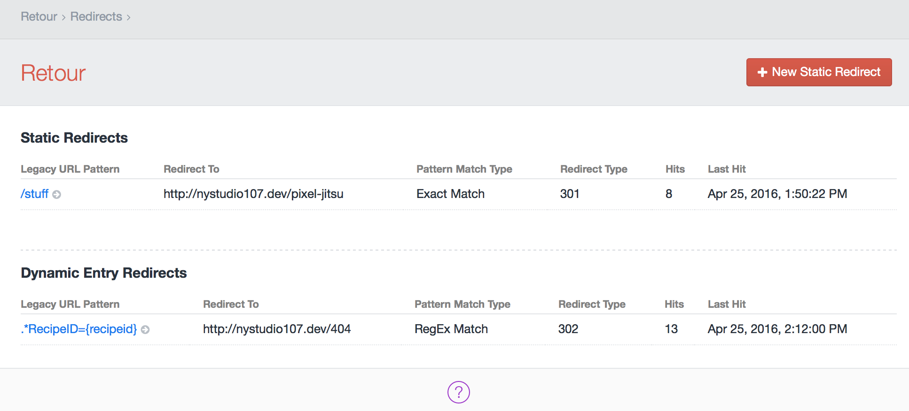
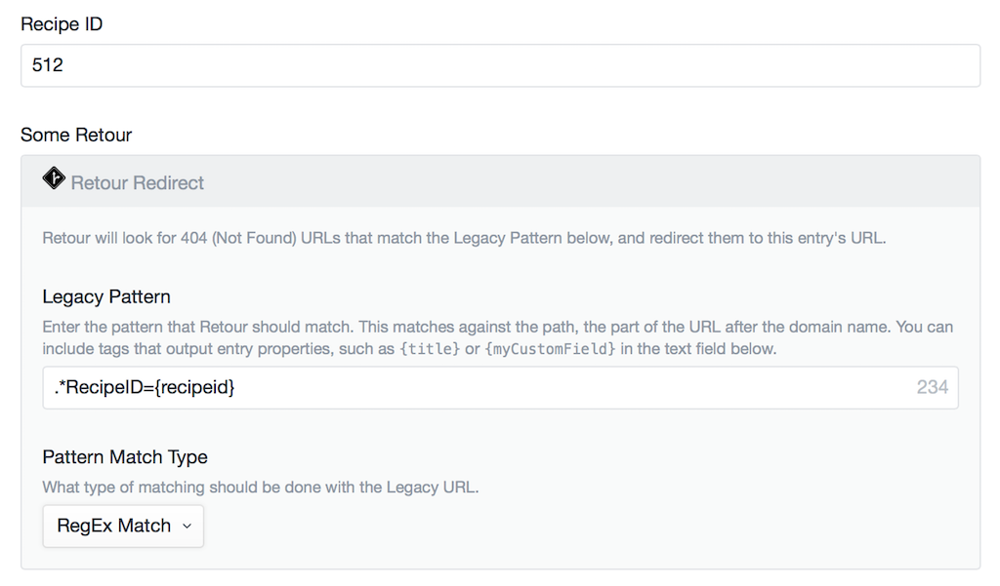
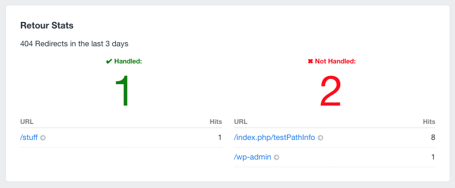

# Retour plugin for Craft CMS

Retour allows you to intelligently redirect legacy URLs, so that you don't lose SEO value when rebuilding & restructuring a website.

## Installation

To install Retour, follow these steps:

1. Download & unzip the file and place the `retour` directory into your `craft/plugins` directory
2.  -OR- do a `git clone https://github.com/nystudio107/retour.git` directly into your `craft/plugins` folder.  You can then update it with `git pull`
3.  -OR- install with Composer via `composer require nystudio107/retour`
4. Install plugin in the Craft Control Panel under Settings > Plugins
5. The plugin folder should be named `retour` for Craft to see it.  GitHub recently started appending `-master` (the branch name) to the name of the folder for zip file downloads.

Retour works on Craft 2.4.x, Craft 2.5.x, and Craft 2.6.x.

## Retour Overview

Retour allows you to intelligently redirect legacy URLs, so that you don't lose SEO value when rebuilding & restructuring a website.

In addition to supporting traditional exact and RegEx matching of URL patterns, Retour also has a Retour Redirect FieldType that you can add to your entries. This allows you to have dynamic entry redirects that have access to the data in your entries when matching URL patterns.

Retour will also automatically create a redirect for you if you change an entry's slug, or move an entry around in a Structure.

Retour is written to be performant. There is no impact on your website's performance until a 404 exception happens; and even then the resulting matching happens with minimal impact.

Don't just rebuild a website. Transition it with Retour.

## Why Use a Plugin for Redirects?

If you have just a few static redirects, then your best bet is to put them in your `.htaccess` file, or better yet, in your `.conf` file for your virtual host.  However, there are a number of cases where using a plugin to handle it is a **better** solution:

1. If you have a large number of redirects, it will slow down every single request your web server handles unnecessarily if they are in `.htaccess` or `.conf`
2. Often the URL patterns from the legacy website do not match the new website URLs in a deterministic way, which makes creating redirects difficult
3. Sometimes you don't have access to the server config files, or you want to give your client the ability to manage redirects easily

Retour solves these problems:

1. Retour only attempts to do a redirect after the web server has already thrown a 404 exception.  Once a redirect mapping is successfully determined, it also caches the result for speedy resolution of the next redirect request.
2. Retour also gives you the ability to do Dynamic Entry Redirects that allow you to import a piece of legacy data into your entries to use as a key for determining the new URL mapping.  In this way, utterly dissimilar URLs can be mapped for redirection effectively.
3. It provides an easy to use GUI that the client can use from Craft's AdminCP, and keeps statistics on the 404 hits (and misses)

### A Word about .htaccess

People using the Apache webserver are familiar with the `.htaccess` file, and may even be using it for redirects.  It's very likely that you should not be using `.htaccess` at all; instead you should disable `.htaccess` via `AllowOverride none` and make your configuration changes in your webserver configuration files.  From [Apache HTTP Server Tutorial: .htaccess files](https://httpd.apache.org/docs/current/howto/htaccess.html)

    There are two main reasons to avoid the use of .htaccess files.

    The first of these is performance. When AllowOverride is set to allow the
    use of .htaccess files, httpd will look in every directory for .htaccess
    files. Thus, permitting .htaccess files causes a performance hit, whether or
    not you actually even use them! Also, the .htaccess file is loaded every
    time a document is requested.

    Further note that httpd must look for .htaccess files in all higher-level
    directories, in order to have a full complement of directives that it must
    apply. (See section on how directives are applied.) Thus, if a file is
    requested out of a directory /www/htdocs/example, httpd must look for the
    following files:

    /.htaccess
    /www/.htaccess
    /www/htdocs/.htaccess
    /www/htdocs/example/.htaccess

    And so, for each file access out of that directory, there are 4 additional
    file-system accesses, even if none of those files are present. (Note that
    this would only be the case if .htaccess files were enabled for /, which is
    not usually the case.)

    In the case of RewriteRule directives, in .htaccess context these regular
    expressions must be re-compiled with every request to the directory, whereas
    in main server configuration context they are compiled once and cached.
    Additionally, the rules themselves are more complicated, as one must work
    around the restrictions that come with per-directory context and
    mod_rewrite. Consult the Rewrite Guide for more detail on this subject.

As you can see, avoiding the use of `.htaccess` completely is best if at all possible, and especially avoid it for RewriteRule directives, such as 404 rewrites.

## Dynamic Entry Redirects

Retour implements a Retour Redirect FieldType that you can add to your Entry Types.  Retour will look for 404 (Not Found) URLs that match the Legacy URL Pattern, and redirect them to this entry's URL.

You also get the context of the `entry` that you can use when matching legacy URLs; so if you've imported a field called `recipeid` into your new website, you can the Retour Redirect FieldType look for it in your Legacy URL Pattern, e.g.: `/old-recipes/{recipeid}`

This allows you to can key off of a piece of legacy data that was imported, for the cases when the new URL patterns don't look anything like the Legacy URL Patterns, or follow any pattern that RegEx is useful for matching.

### Creating a Retour Redirect Field

Create a Retour Redirect field as you would any other field; then set the default values for it.  For new entries, it will default to the values entered here, so you can put your matching pattern in once, rather than having to do it for each entry.

* **Default Legacy URL Pattern** - Enter the URL pattern that Retour should match. This matches against the path, the part of the URL after the domain name. You can include tags that output entry properties, such as `{title}` or `{myCustomField}` in the text field below. e.g.: Exact Match: `/recipes/{recipeid}` or RegEx Match: `.*RecipeID={recipeid}$` where `{recipeid}` is a field handle to a field in this entry.
* **Default Pattern Match Type** - What type of matching should be done with the Legacy URL Pattern. Details on RegEx matching can be found at [regexr.com](http://regexr.com) If a plugin provides a custom matching function, you can select it here.
* **Default Redirect Type** - Select whether the redirect should be permanent or temporary.
* **Redirect Changeable** - Whether to allow the user to change the redirect while editing the entry.

### Configuring a Retour Redirect Field

* **Legacy URL Pattern** - Enter the URL pattern that Retour should match. This matches against the path, the part of the URL after the domain name. You can include tags that output entry properties, such as `{title}` or `{myCustomField}` in the text field below. e.g.: Exact Match: `/recipes/{recipeid}` or RegEx Match: `.*RecipeID={recipeid}$` where `{recipeid}` is a field handle to a field in this entry.
* **Pattern Match Type** - What type of matching should be done with the Legacy URL Pattern. Details on RegEx matching can be found at [regexr.com](http://regexr.com) If a plugin provides a custom matching function, you can select it here.
* **Redirect Type** - Select whether the redirect should be permanent or temporary.

**Note:** if you add a Retour Redirect FieldType to an existing Section, or you import data from a foreign source into a Section with a Retour Redirect FieldType, the default values you set for the Retour Redirect FieldType will not be propagated to the entry yet.  To cause that to happen, go to **Settings->Sections** then click on the Section to edit it, and hit **Save**.  This will cause all of the entries in that section to be re-saved, and Retour will fill in the default field values.

### Multiple Redirects to the Same Entry

If you need more than one Legacy URL Pattern to redirect to a given entry, simply create a new Retour Redirect field (so that you get a new set of default options) and add it to your Entry Type layout.  You can add as many as you like.

## Static Redirects

### Manually Creating Static Redirects

Static Redirects are useful when the Legacy URL Patterns and the new URL patterns are deterministic.  You can create them by clicking on **Retour->Redirects** and then clicking on the **+ New Static Redirect** button.

* **Legacy URL Pattern** - Enter the URL pattern that Retour should match. This matches against the path, the part of the URL after the domain name. e.g.: Exact Match: `/recipes/` or RegEx Match: `.*RecipeID=(.*)`
* **Destination URL** - Enter the destination URL that should be redirected to. This can either be a fully qualified URL or a relative URL. e.g.: Exact Match: `/new-recipes/` or RegEx Match: `/new-recipes/$1`
* **Pattern Match Type** - What type of matching should be done with the Legacy URL Pattern. Details on RegEx matching can be found at [regexr.com](http://regexr.com) If a plugin provides a custom matching function, you can select it here.
* **Redirect Type** - Select whether the redirect should be permanent or temporary.

### Importing an Existing .htaccess file

Retour also allows you to import an existing `.htaccess` file and all of the redirects it contains into Retour by clicking on **Retour->Redirects** and then clicking on the **Import .htaccess File** button.

It will import redirects from `Redirect`, `RedirectMatch`, and `RewriteRule` directives in the file.  It will ignore `RewriteRule`s that are not redirects.

It asks your browser to look for only `text` files to upload; if the `.htaccess` file you have isn't a `.txt` file, you can force it to allow you to upload it by choosing **Format: All Files**.

### Renamed Slug Redirects

If you rename an entry's `slug` (and the Section the entry is in has URLs), Retour will automatically create a static redirect for you to keep traffic going to the right place.  It will also automatically create a static redirect if you move an entry around in a Structure.

It will appear listed under the "Static Redirects" section like any other static redirect.

## Retour Statistics

Retour keeps track of every 404 your website receives.  You can view them by clicking on **Retour->Statistics**.  

Only one record is saved per URL Pattern, so the database won't get clogged with a ton of records.

### Retour Widget

If you'd like to see an overview of the Retour Statistics in your dashboard, you can add a Retour widget to your Dashboard:

It displays the total number of handled and not handled 404s, and the 5 most recent 404 URLs in each category right in your dashboard.

## Developer Info

### Custom Match Functions via Plugin

Retour allows you to implement a custom matching function via plugin, if the Exact and RegEx matching are not sufficient for your purposes.

In your main plugin class file, simply add this function:

    /**
     * retourMatch gives your plugin a chance to use whatever custom logic is needed for URL redirection.  You are passed
     * in an array that contains the details of the redirect.  Do whatever matching logic, then return true if is a
     * matched, false if it is not.
     *
     * You can alter the 'redirectDestUrl' to change what URL they should be redirected to, as well as the 'redirectHttpCode'
     * to change the type of redirect.  None of the changes made are saved in the database.
     *
     * @param mixed An array of arguments that define the redirect
     *            $args = array(
     *                'redirect' => array(
     *                    'id' => the id of the redirect record in the retour_redirects table
     *                    'associatedElementId' => the id of the entry if this is a Dynamic Entry Redirect; 0 otherwise
     *                    'redirectSrcUrl' => the legacy URL as entered by the user
     *                    'redirectSrcUrlParsed' => the redirectSrcUrl after it has been parsed as a micro template for {variables}
     *                        via renderObjectTemplate().  This is typically what you would want to match against.
     *                    'redirectMatchType' => the type of match; this will be set to your plugin's ClassHandle
     *                    'redirectDestUrl' => the destination URL for the entry this redirect is associated with, or the
     *                        destination URL that was manually entered by the user
     *                    'redirectHttpCode' => the redirect HTTP code (typically 301 or 302)
     *                    'hitCount' => the number of times this redirect has been matched, and the redirect done in the browser
     *                    'hitLastTime' => the date and time of the when this redirect was matched
     *                    'locale' => the locale of this redirect
     *                )
     *            );
     * @return bool Return true if it's a match, false otherwise
     */
    public function retourMatch($args)
    {
        return true;
    }

Your plugin will then appear in the list of Pattern Match Types that can be chosen from via Retour->Redirects or via the Retour Redirect FieldType.

### Utility Functions

`craft.retour.getHttpStatus` in your templates will return the HTTP Status code for the current template, so you can display a special message for people who end up on a page via a `301` or `302` redirect.

## Retour Roadmap

Some things to do, and ideas for potential features:

* Craft 3 compatibility
* Add the ability to mass-import redirects from a CSV file

Brought to you by [nystudio107](http://nystudio107.com)